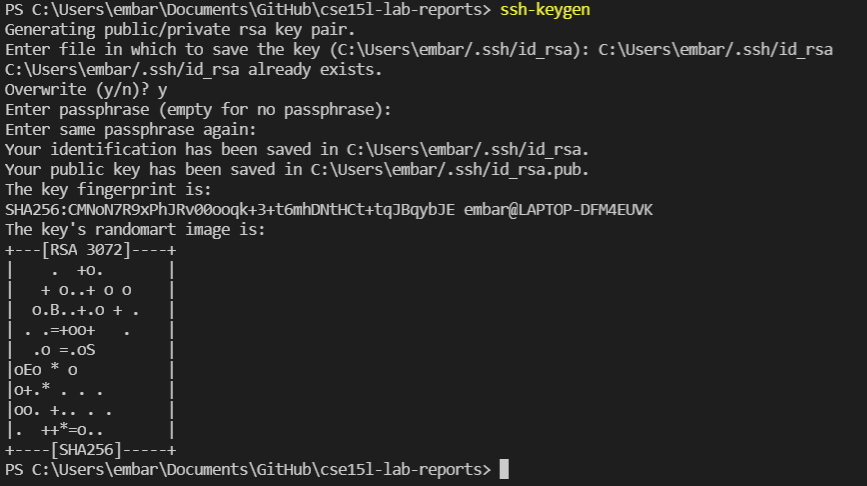
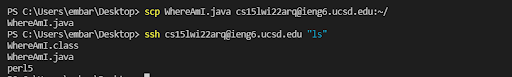
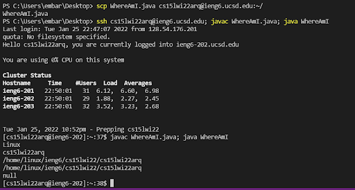

# Week 2 Lab Report: Tutorial for Remote Access
## By Jerry Gong


## **Part 1: Installing Visual Studio Code**


* Go to the [Visual Studio Code website](https://code.visualstudio.com/), then follow the instructions to download and install.
* Once you complete, you should be able to open VScode with a window like this:

  


## **Part 2: Remotely Connecting**


* If you're on Windows, go to [Install OpenSSH](https://docs.microsoft.com/en-us/windows-server/administration/openssh/openssh_install_firstuse) and install this program called OpenSSH which is capable of connect your computer to other computers.
* Then, look up your own account for CSE15L by going to [account lookup](https://sdacs.ucsd.edu/~icc/index.php).
* At first, open a terminal in VSCode (Click Terminal and choose New Terminal on menu option). Enter a command like this, but with your own course-specific account.

    `$ ssh cs15lwi22jjj@ieng6.ucsd.edu`
* If this is your first time logging in, you may get a message like this:

    `The authenticity of host 'ieng6.ucsd.edu (128.54.70.227)' can't be established.
    RSA key fingerprint is SHA256:ksruYwhnYH+sySHnHAtLUHngrPEyZTDl/1x99wUQcec.
    Are you sure you want to continue connecting (yes/no/[fingerprint])?`
* Say yes to this message and give password to continue logging in.
* When you successful log in, your terminal should look something like this:

    


## **Part 3: Trying Some Commands**


* Commands can be ran both on your computer and on the remote computer after ssh-ing. Below are some useful commands to try out!

    `cd ~` - Change directory.
    
    `ls` - Lists all files in the current directory except for hidden files.
    
    `ls -a` - Lists all files including hidden files(files with names beginning with a dot).
    
    `ls -l` - Gives a long listing of all files.
    
    `ls -t` - Lists the files in order of the time when they were last modified.
    
    `cp ~` - Copies files or group of files or directory.
  
* Running commands in the terminal should look like this:

    


## **Part 4: Moving FIles with `scp`**


* An important step in working remotely is being able to copy files between the computers connected. The command that does this is called `scp`, and we always input this command from the client(from your computer not logged in `ieng6`). 
* To try out this command, first create a file on your computer and put any contents into it
* For example, create a file called `WhereAmI.java` and put the following contents in:
    ```
    class WhereAmI {
  public static void main(String[] args) {
    System.out.println(System.getProperty("os.name"));
    System.out.println(System.getProperty("user.name"));
    System.out.println(System.getProperty("user.home"));
    System.out.println(System.getProperty("user.dir"));
     }
   }
    ```
    
* Then, in the terminal from the directory of this file, run this command:(replace with your own username)

    `scp WhereAmI.java cs15lwi22zz@ieng6.ucsd.edu:~/`
    
* You'll be prompted for a password just like when you log in. Then, log into ieng6 with ssh again and use `ls`, you'll see the file in your remote directory, and now you should be able to run the file with commands `java` and `javac`. It should look like:
 
    


## **Part 5: Setting an SSH Key**


* It can be frustrating sometimes when we have to type our password everytime we log in or run commands to a remote server. In this case, there is a great solution - `ssh` keys.
* The idea behind it is a program called `ssh-keygen`. It creates a pair of files called the public key and private key. After copying the public key to a particular location on the server, and the private key in a location on the client, the `ssh` command will be able to use this pair of files instead of your password.
* Below is what the setup should look like:

    
    
* It means that we already created two new files: the private key (in the file `id_rsa`) and the public key (in the file `id_rsa.pub`), stored in the `.ssh` directory on your computer.
* Now we have to copy the public key to the `.ssh` directory on the server
* First, log in into your account via ssh and make a directory by using `mkdir .ssh`.
* Then log out and type the command(replace with your own path and account)
    `scp  C:\Users\embar/.ssh/id_rsa.pub. cs15lwi22arq@ieng6.ucsd.edu:~/.ssh/authorized_keys`
    
* After this step, you should be able to log in without a password.
    
    .png)


## **Part 6: Optimizing Remote Running**


* There are even more ways to make our remote running experience more convenient. Examples include:
    
    `ssh cs15lwi22arq@ieng6.ucsd.edu "ls"` - Writing a command in quotes at the end after an `ssh` command prompts it to directly run on the remote server then exit.
    
    
    
    `cp WhereAmI.java OtherMain.java; javac OtherMain.java; java WhereAmI` - We can use semicolons to run multiple commands on the same line.
  * Use the up-arrow key to recall the last command that was run.
  * Type faster!
* I also tried to make a local change to WhereAmI.java and save it to remote server

    
  * I have all the commands I needed stored in a plain text file. The process involved making a change to WhereAmI.java(3 keystrokes) and copying and running the commmands(9 keystrokes). Although I did not keep it under 10 keystrokes, the whole process was still more pleasant than having to type out all the commands.
