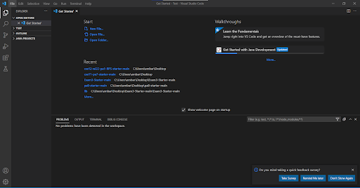
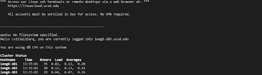
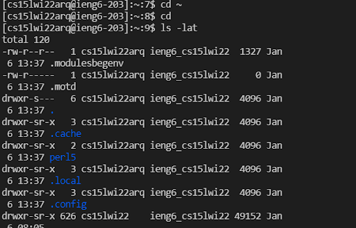
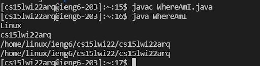

# Week 2 Lab Report: Tutorial for Remote Access
## By Jerry Gong
> **Part 1: Installing Visual Studio Code**

* Go to the [Visual Studio Code website](https://code.visualstudio.com/), then follow the instructions to download and install.
* Once you complete, you should be able to open VScode with a window like this:

  
 
 > **Part 2: Remotely Connecting**

* If you're on Windows, go to [Install OpenSSH](https://docs.microsoft.com/en-us/windows-server/administration/openssh/openssh_install_firstuse) and install this program called OpenSSH which is capable of connect your computer to other computers.
* Then, look up your own account for CSE15L by going to [account lookup](https://sdacs.ucsd.edu/~icc/index.php).
* At first, open a terminal in VSCode (Click Terminal and choose New Terminal on menu option). Enter a command like this, but with your own course-specific account.

    `$ ssh cs15lwi22jjj@ieng6.ucsd.edu`
* If this is your first time logging in, you may get a message like this:

    `The authenticity of host 'ieng6.ucsd.edu (128.54.70.227)' can't be established.
    RSA key fingerprint is SHA256:ksruYwhnYH+sySHnHAtLUHngrPEyZTDl/1x99wUQcec.
    Are you sure you want to continue connecting (yes/no/[fingerprint])?`
* Say yes to this message and give password to continue logging in.
* When you successful log in, your terminal should look something like this:

    

> **Part 3: Trying Some Commands**

* Commands can be ran both on your computer and on the remote computer after ssh-ing. Below are some useful commands to try out!

    `cd ~` - Change directory.
    
    `ls` - Lists all files in the current directory except for hidden files.
    
    `ls -a` - Lists all files including hidden files(files with names beginning with a dot).
    
    `ls -l` - Gives a long listing of all files.
    
    `ls -t` - Lists the files in order of the time when they were last modified.
    
    `cp ~` - Copies files or group of files or directory.
  
* Running commands in the terminal should look like this:

    
    
> **Part 4: Moving FIles with `scp`**

* An important step in working remotely is being able to copy files between the computers connected. The command that does this is called `scp`, and we always input this command from the client(from your computer not logged in `ieng6`). 
* To try out this command, first create a file on your computer and put any contents into it
* For example, create a file called `WhereAmI.java` and put the following contents in:
    ```
    class WhereAmI {
  public static void main(String[] args) {
    System.out.println(System.getProperty("os.name"));
    System.out.println(System.getProperty("user.name"));
    System.out.println(System.getProperty("user.home"));
    System.out.println(System.getProperty("user.dir"));
     }
   }
    ```
    
* Then, in the terminal from the directory of this file, run this command:(replace with your own username)

    `scp WhereAmI.java cs15lwi22zz@ieng6.ucsd.edu:~/`
    
* You'll be prompted for a password just like when you log in. Then, log into ieng6 with ssh again and use `ls`, you'll see the file in your remote directory, and now you should be able to run the file with commands `java` and `javac`. It should look like:
 
    
    
> **Part 5: Setting an SSH Key**

* It can be frustrating sometimes when we have to type our password everytime we log in or run commands to a remote server. In this case, there is a great solution - `ssh` keys.
* The idea behind it is a program called `ssh-keygen`. It creates a pair of files called the public key and private key. After copying the public key to a particular location on the server, and the private key in a location on the client, the `ssh` command will be able to use this pair of files instead of your password.
* Below is what the setup should look like:

    ```
    # on client (your computer)
    $ ssh-keygen
    Generating public/private rsa key pair.
    Enter file in which to save the key (C:\Users\embar/.ssh/id_rsa): C:\Users\embar/.ssh/id_rsa
    Enter passphrase (empty for no passphrase): 
    Enter same passphrase again: 
    Your identification has been saved in C:\Users\embar/.ssh/id_rsa
    Your public key has been saved in C:\Users\embar/.ssh/id_rsa.pub
    The key fingerprint is:
    SHA256:jZaZH6fI8E2I1D35hnvGeBePQ4ELOf2Ge+G0XknoXp0 joe@Joes-Mac-mini.local
    The key's randomart image is:
    +---[RSA 3072]----+
    |                 |
    |       . . + .   |
    |      . . B o .  |
    |     . . B * +.. |
    |      o S = *.B. |
    |       = = O.*.*+|
    |        + * *.BE+|
    |           +.+.o |
    |             ..  |
    +----[SHA256]-----+
