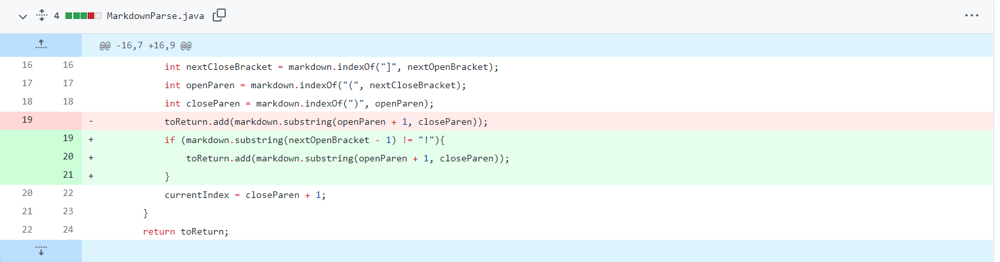

# Week 4 Lab Report: Debugging
## By Jerry Gong

## **Code Change #1**
Show a screenshot of the code change diff from Github:

Link to the test file for a failure-inducing input that prompted you to make that change:

[test2.md](https://github.com/JGong7/markdown-parse/edit/main/test2.md)

Show the symptom of that failure-inducing input by showing the output of running the file at the command line for the version where it was failing (this should also be in the commit message history)
Write 2-3 sentences describing the relationship between the bug, the symptom, and the failure-inducing input.
## **Code Change #2**
Show a screenshot of the code change diff from Github (a page like this)
Link to the test file for a failure-inducing input that prompted you to make that change
Show the symptom of that failure-inducing input by showing the output of running the file at the command line for the version where it was failing (this should also be in the commit message history)
Write 2-3 sentences describing the relationship between the bug, the symptom, and the failure-inducing input.
## **Code Change #3**
Show a screenshot of the code change diff from Github (a page like this)
Link to the test file for a failure-inducing input that prompted you to make that change
Show the symptom of that failure-inducing input by showing the output of running the file at the command line for the version where it was failing (this should also be in the commit message history)
Write 2-3 sentences describing the relationship between the bug, the symptom, and the failure-inducing input.
