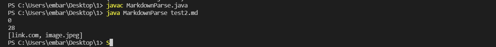
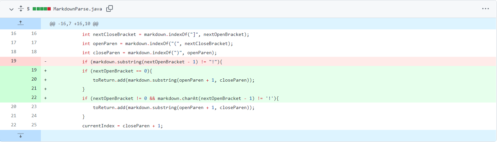
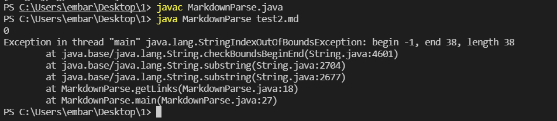
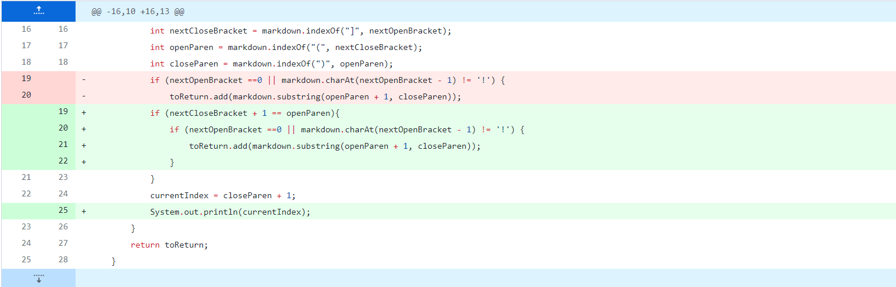
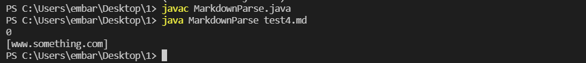

# Week 4 Lab Report: Debugging
## By Jerry Gong

## **Code Change #1**
**Show a screenshot of the code change diff from Github:**

**Link to the test file for a failure-inducing input that prompted you to make that change:**

[test2.md](https://github.com/JGong7/markdown-parse/blob/main/test2-file.md?plain=1)

**Show the symptom of that failure-inducing input by showing the output of running the file at the command line for the version where it was failing (this should also be in the commit message history)**

**Write 2-3 sentences describing the relationship between the bug, the symptom, and the failure-inducing input:**

In the failure-inducing input, there is a link and an image. With our initial purpose, we wanted to only print the link. The symptom in this failed case is that the command-line output included the image name, which was not wanted. The bug was that the code does not check if there exists an exclamation mark before the open bracket in order to distinguish between image and link formats. The failure-inducing input triggered the symptom, which was caused by a bug.

## **Code Change #2**
**Show a screenshot of the code change diff from Github (a page like this)**

**Link to the test file for a failure-inducing input that prompted you to make that change**

[test5.md](https://github.com/JGong7/cse15l-lab-reports/blob/main/test5.md)

**Show the symptom of that failure-inducing input by showing the output of running the file at the command line for the version where it was failing (this should also be in the commit message history)**

**Write 2-3 sentences describing the relationship between the bug, the symptom, and the failure-inducing input.**

The failure-inducing input has a link at the first line of the markdown file. Therefore, when we check the index before the open bracket to see if it's an image, the index will be -1, which will throw an exception. The symptom is the StringIndexOutOfBoundsException thrown by java on the command-line output. The bug is that our code does not consider the edge case where the link has its open bracket at first index. The failure-inducing input triggered the symptom, which was caused by a bug.

## **Code Change #3**
**Show a screenshot of the code change diff from Github (a page like this)**

**Link to the test file for a failure-inducing input that prompted you to make that change**

[test4.md](https://github.com/JGong7/markdown-parse/blob/main/test4-file.md)

**Show the symptom of that failure-inducing input by showing the output of running the file at the command line for the version where it was failing (this should also be in the commit message history)**

**Write 2-3 sentences describing the relationship between the bug, the symptom, and the failure-inducing input.**

The failure-inducing input has the incorrect format for putting a link. The bracket and parenthesis are not next to each other, and therefore we don't expect the code to output any links. The symptom is that the code actually prints out the link inside the parenthesis even though it shouldn't be. The bug is that the code does not check if the bracket and parenthesis are directly next to each other. The failure-inducing input triggered the symptom, which was caused by a bug.
