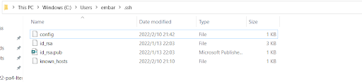
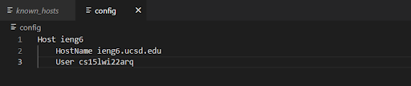
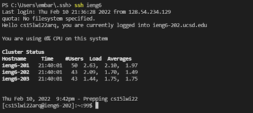
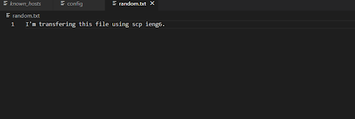
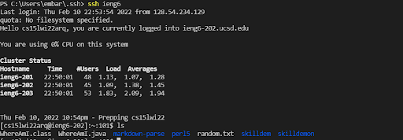

# Week 6 Lab Report: Streamline ssh Configuration
## By Jerry Gong

For this lab, I chose to streamline ssh configuration with creating a config file and storing the username in it.

**First, find the .ssh folder in our computer and create a config file.**

**Then I edited the file with VS Code and put in lines that included my username. The file should have the name of the host and the specific account name.**

**If things are setup correctly, we can simply use the command `ssh ieng6` to log in to our account. The output should look like the picture below:**

**Streamline ssh configuration can be useful when logging in, since we don't have to type our username. It also works with other commands, such as scp.**

**Let's try to use command scp with our configuration. First, I created a file to be copied. It's called random.txt"**

**Then we use the scp command just like how we usually do, but instead of typing our username, we simply type ieng6.**

**The text file should copied to the server now. We can confirm it by logging in and typing in command to list the files**

**File copied. Task done :)**
