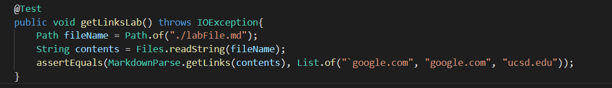
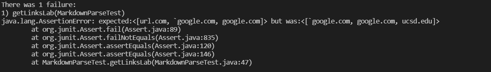

# Week 8 Lab Report: Markdown Snippets Testing
## By Jerry Gong

**Snippet 1**

The output of CommonMark Demo Site:

According to the output above, the expected output of running MarkdownParse on this snippet should be **["`google.com", "google.com", "ucsd.edu"]**.

I turned the snippet into a test by writing the codes below.

For my own implementation, the test failed.

For the implementation I reviewed, .
