# Week 8 Lab Report: Markdown Snippets Testing
## By Jerry Gong

[My repository](https://github.com/JGong7/markdown-parse-1)

[Reviewed repository](https://github.com/sallada1/markdown-parse)

**Snippet 1**

The output of CommonMark Demo Site:
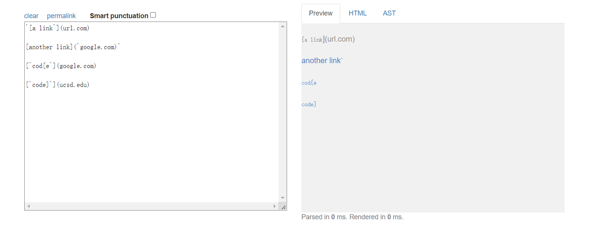
According to the output above, the expected output of running MarkdownParse on this snippet should be **["`google.com", "google.com", "ucsd.edu"]**.

I turned the snippet into a test by writing the codes below.
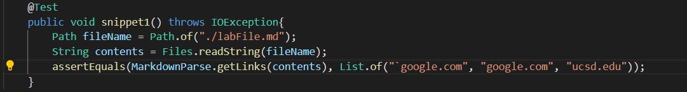

For my own implementation, the test failed.
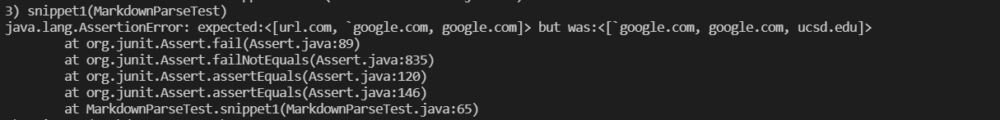

For the implementation I reviewed, the test failed as well.
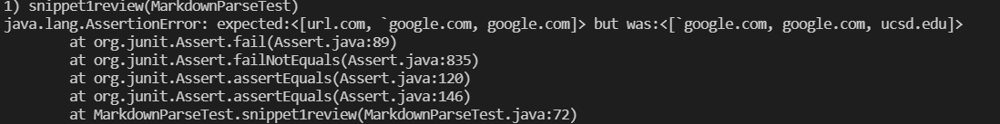

**Snippet 2**

The output of CommonMark Demo Site:
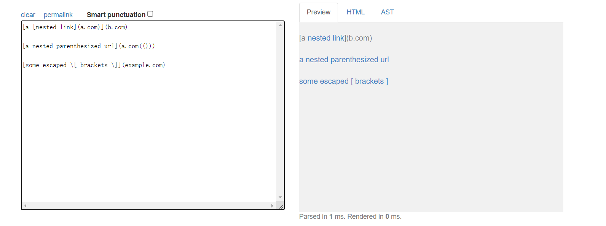
According to the output above, the expected output of running MarkdownParse on this snippet should be **["a.com", "a.com(())", "example.com"]**.

I turned the snippet into a test by writing the codes below.
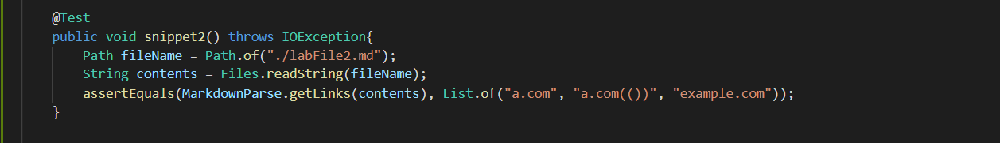

For my own implementation, the test failed.
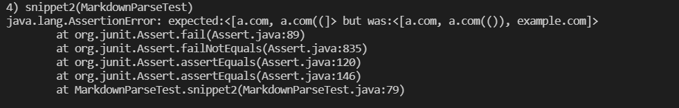

For the implementation I reviewed, the test failed as well.
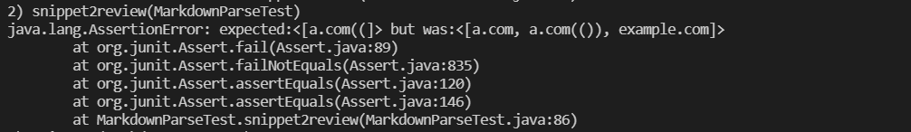

**Snippet 3**

The output of CommonMark Demo Site:
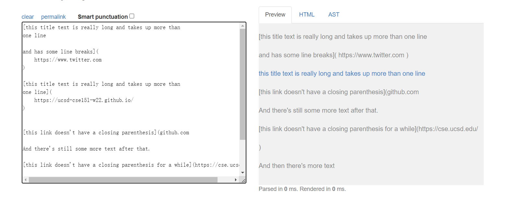
According to the output above, the expected output of running MarkdownParse on this snippet should be **["https://ucsd-cse15l-w22.github.io/"]**.

I turned the snippet into a test by writing the codes below.
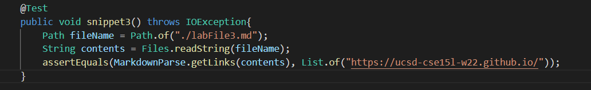

For my own implementation, the test seemed to run into a infinite loop and failed.
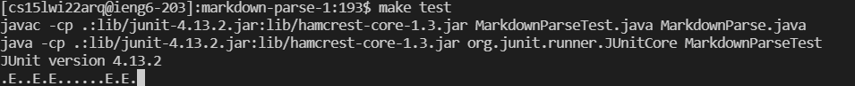

For the implementation I reviewed, the test failed as well.
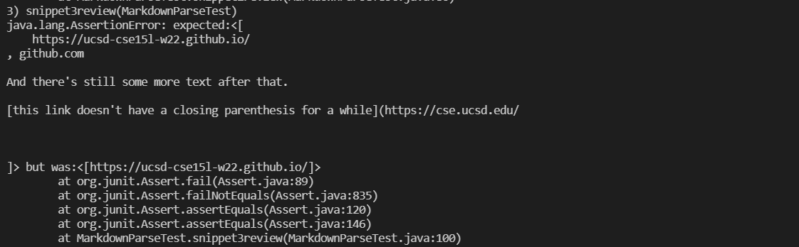

**Answering Questions**
**Snippet 1**
I don't think a change below 10 lines will be able to make my program work for snippet 1 and other backticks related issues. That is because the fourth link in the snippet triggered another bug caused by a feature of my program. My program tends to check if the ending bracket is next to the open parenthesis to determine if it's a valid link, and since the fourth link has two 
