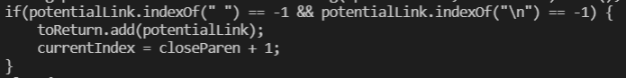

# Week 10 Lab Report: Differences Between Implementations
## By Jerry Gong

# Test #1
Test number: 510

I found the tests with different results by manually comparing the two results 
files from two different repositories. The results text files are obtained from
the makefiles. I added a line of echo that outprints the name of the file before 
each output in order to see which test cases are different.

The actual test file

Joe's output

Our output

The expected output should be empty. This is because there exists a space between the closing
bracket and the opening parenthesis. Therefore, the link inside the parenthesis is not valid.
In this case, our implementation is the correct implementation. Here is the expected output from
commonmark.org.

In my opinion, the problem in joe's code is that it does not check for characters between the closing
bracket and the opening parenthesis. The markdown file considers a link to be valid only when the closing
bracket and the opening parenthesis are next to each other. Therefore, I think joe's code should add something
that can check the spaces between the bracket and the parenthesis.

Some codes that can be added to fix this problem are:

(The important part is `nextCloseBracket + 1 == openParen`. Only consider adding the
link if the closeBracket and openParen are next to each other.)

# Test #2
Test number: 490

I found the tests with different results by manually comparing the two results 
files from two different repositories. The results text files are obtained from
the makefiles. I added a line of echo that outprints the name of the file before 
each output in order to see which test cases are different.

The actual test file

Joe's output

Our output

The expected output should be empty. This is because the link inside the parenthesis are on two
different lines. In order for the link to be valid, the link should be on only one line. Therefore, the link inside the parenthesis is not valid.
In this case, Joe's implementation is the correct implementation. Here is the expected output from
commonmark.org.

In my opinion, the problem in our implementation is that we did not check if there is `\n` characters inside the links.
Since the escape characer `\n` is used to jump to next line, we should verify a valid link only when it does not have `\n`.
Therefore, I think our code should add a condition to check for escape characters.

Some codes that can be added to fix the implementation are:

(The important part is `potentialLink.indexOf("\n") == -1`. When there is no `\n`, add
the link to the output.)
